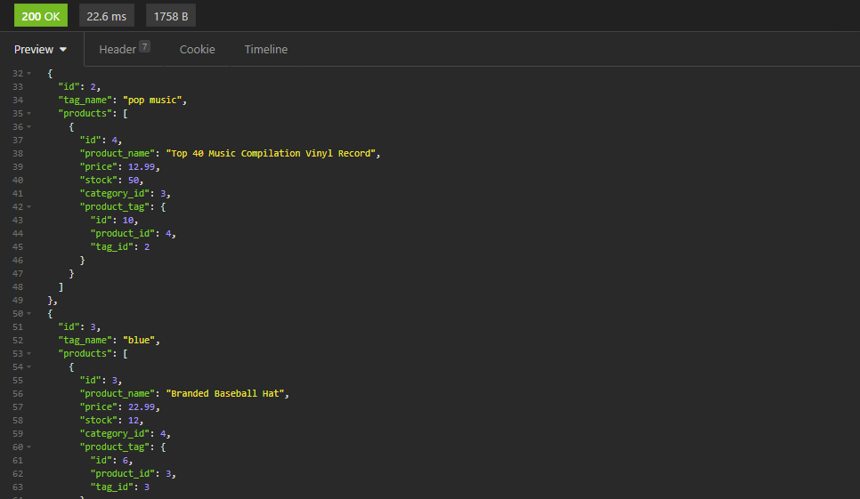

# E-commerce
URL to this repository

## Description
E-commerce is a backend web-api with the needed routes to set up a retail website.

## Table of Contents
* [Technologies](#technologies)
* [Installation](#installation)
* [Usage](#usage)
* [Tests](#tests)
* [Questions](#questions)

## Technologies
* mySQL
* Sequelize
* Javascript

## Installation
To install this repository, please clone or download the zip version from GitHub.

## Usage
With this repository, the user will be able to create the backend database for commercial uses as it has the needed routes and models

## Tests
After installing this repository, please intialize an "npm install" to download the needed packages.

After installing the packages, please create a .env file to use mySQL to connect to the database. Replace the username and password with your information

* DB_NAME=ecommerce_db
* DB_USER='USERNAME'
* DB_PW='PASSWORD'

After completing the neccessary steps, the user may enter "npm start" to initialize the server, from there, they will be able to use all the features of creating producs, tags, and categories.

## Questions
For any questions or concerns, please email me at matthewkausfox@gmial.com

Thank you.